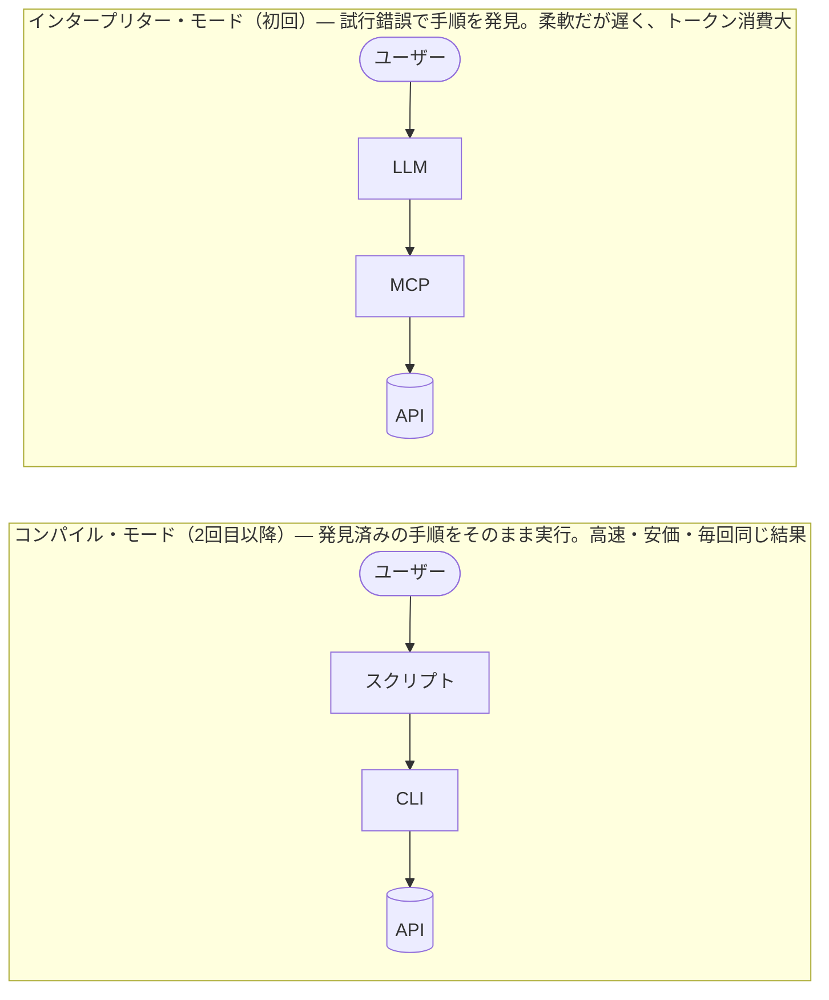
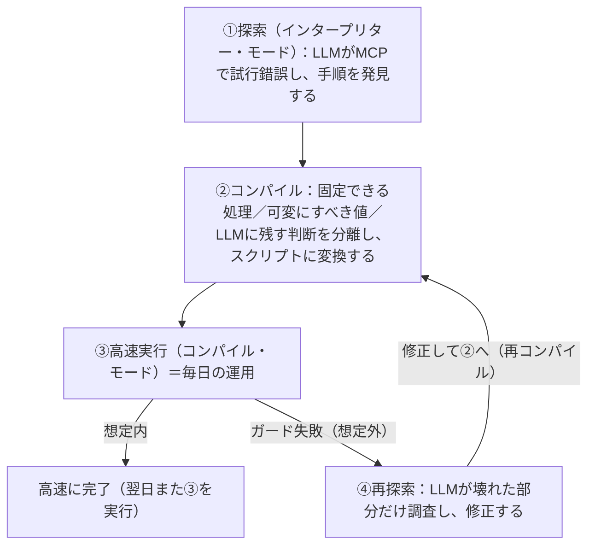
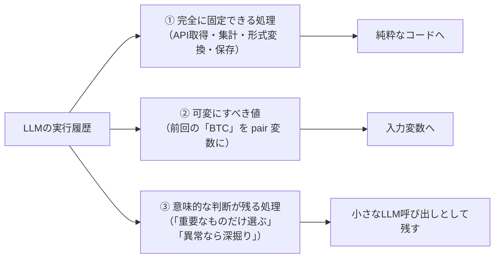
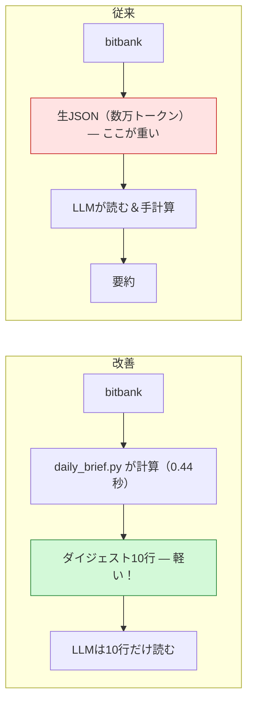
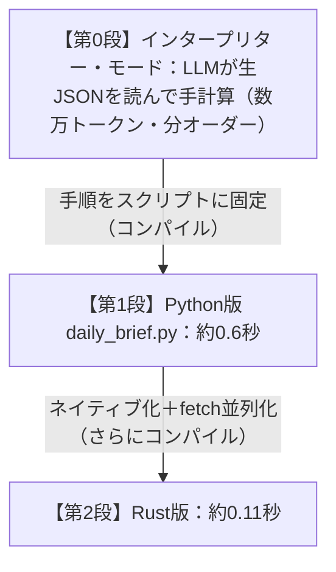
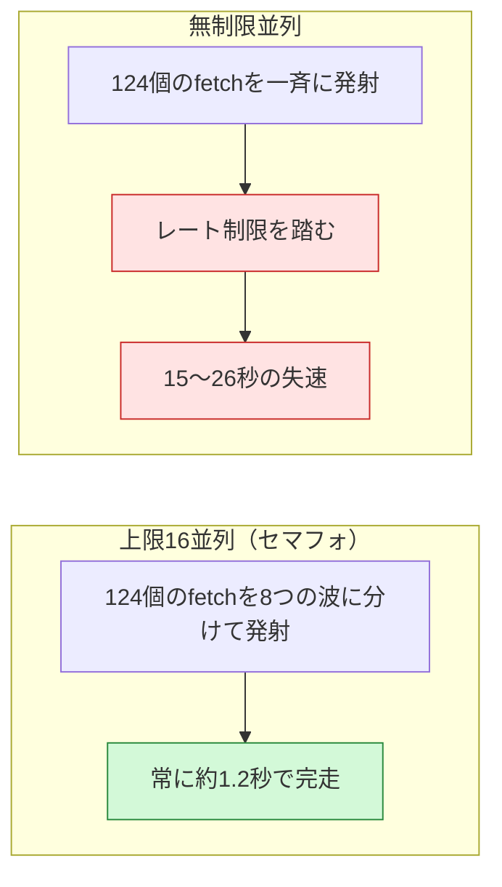

# LLMのインタープリター・モードとコンパイル・モード

*— 探索はLLMに、確立した手順は決定的なコードに。bitbank-lab-cli による実証 —*

著者: **aobathree**（ChatGPT・Claude・Cursor の助けを借りて作成）
初版 2026年8月1日／改訂版 2026年8月2日（Rust実験・スケール実験を追記）
リポジトリ: **https://github.com/aobathree/llm-interpreter-compiler-modes**（本稿・ドラフト・実証コードを収録）

## はじめに：こんなアイデアは成り立つでしょうか

同じAPI *[1]* の上に、MCP *[2]* と CLI *[3]* という二つの入口があるとします。初回は MCP を使い、LLM に多くのトークン *[4]* と時間をかけて調査・計画・実行をしてもらう。これを**インタープリター・モード**と呼びます。2回目以降は、確立した同じ手順を「コンパイル」して、CLI を使ったスクリプトとして高速・低コストで再実行する。これが**コンパイル・モード**です。

*図1: 二つのモード*

このアイデアは成り立つのか、それとも既に当たり前なのか——ChatGPT と Cursor に問いかけた回答と、bitbank-lab-cli での実例をまとめたのが本稿です。

## 概念の整理：「探索」と「実行」を分ける

両者の回答は一致していました。**このアイデアは成り立ち、業界もまさにその方向へ収束しつつある**、というものです。

本質は、「未知の問題の手順を**発見**するフェーズ」と「発見済みの手順を**再実行**するフェーズ」の分離にあります。前者は柔軟ですが遅く高価、後者は高速・安価で、毎回同じ結果が得られます。さらに、想定外が起きたときだけ LLM に戻る「再探索」を加えると、全体は次のようなループになります。

*図2: 探索→コンパイル→実行→再探索のループ*

これは、事前に全部を機械語にしてしまう AOTコンパイル *[5]* というより、実際の実行の様子を観察してから最適化する **JITコンパイル** *[6]* に近い構図です。想定外のときに一段遅いモードへ戻る④は、JIT でいう「脱最適化」*[7]* に相当します。

この方向性は業界の潮流とも一致します。Cloudflare の Code Mode や Anthropic の「Code execution with MCP」は「MCPツールを一つずつ LLM に呼ばせるのではなく、コードを書かせて実行するほうが速くて安い」という同じ問題意識を扱っていますし、Agent Skills *[8]* は確立した手順の資産化にあたります。研究の世界でも Voyager や DSPy など先行例の系譜があります。ただし、図2のループ全体——フォールバックと再コンパイルまで含めたライフサイクル——を一貫した体験として設計した例はまだ少なく、体系化の余地が大きい領域です。

## 何をコンパイルできるのか

手順のすべてをスクリプトにできるわけではありません。LLM の実行履歴は、次の三種類に分解して扱う必要があります。

*図3: コンパイル時の三分解*

つまり最適な結果は「LLM を完全に消したスクリプト」とは限らず、多くの場合は「**決定論的な骨格 ＋ 少数の限定された LLM 判断 ＋ 異常時の LLM 復帰**」という構成になります。また、単純な「記録して再生」では、たまたま必要だったリトライの誤固定や、値のハードコード、書き込みの二重実行などで壊れます。可変値の識別、冪等性 *[9]* への配慮、想定外を検知するガード条件、コンパイル直後に同じ入力で結果一致を確かめるゴールデンテスト *[10]* が最低限必要です。

## 実例：bitbank-lab-cli の daily_brief.py

このモデルを、暗号通貨の日次「商い状況」分析で実際に運用しています。

**インタープリター・モード（初回）**では、`bitbank candles` で数百本×複数ペアの生のローソク足 *[11]* JSONを取得し、LLM がそれを読み込んで SMA や RSI などのテクニカル指標 *[12]* を手計算していました。生JSONだけで数万トークンを消費し、計算は遅く、桁ミスの検算コストもかかります。ただ、この試行錯誤を通じて「毎日見るべき指標と出力の形」が確定しました。

**コンパイル・モード（2回目以降）**では、確定した手順を `tools/daily_brief.py` に固定化しました。計算はすべて Python 側で行い、LLM は1ペア3行の圧縮ダイジェストだけを読みます。

*図4: daily_brief.py によるトークン削減*

スクリプト本体と設計ノートは上記リポジトリの `tools/` に収録しています。Python 3.9+ と [bitbank-lab-cli](https://github.com/bitbankinc/bitbank-lab-cli)（APIキー不要）があれば、`python tools/daily_brief.py` だけでこの実験をそのまま再現できます。

実測の効果は、実行時間**約0.44秒**（2ペア）、LLM が読む量は**数万トークン → 10行弱**、指標の手計算・検算は**ゼロ**です。取得本数を増やしても LLM のトークン消費は一定のままです。図3の三分解も実践しています——対象ペアは引数や環境変数で指定できるようにし（②）、確定足のみで計算する・ペア単位でエラーを閉じ込めるといったガードを備え（①）、「ダイジェストへの一言コメント」だけを LLM に残しています（③）。運用の合言葉は「daily brief 回して」。LLM はスクリプトを実行し、出てきた10行だけを読んでコメントを添えます。

## コンパイルを推し進める：Rust移植の実験（8/2追記）

コンパイル・モードはどこまで速くできるのでしょうか。`daily_brief.py` を Rust *[13]* に移植して（リポジトリの `rust/` に収録）、実測してみました。出力フォーマットはPython版と1文字単位で同一です。変えたのは実行モデルだけ——ネイティブバイナリ化と、fetch（3ペア×日足・時足＝6回のCLI呼び出し）の全並列化 *[14]* です。

*図5: コンパイルの深化と実測値*

| 実装 | 実行時間（3ペア・中央値） | 備考 |
|---|---|---|
| Python版 | 約0.6秒 | 6回のfetchが逐次 |
| Rust版 | **約0.11秒（約5倍）** | 6回のfetchを並列化 → 実質1回分の待ち時間 |

計測して分かったのは、律速がネットワークだということです。単発の `bitbank candles` 呼び出しは約0.1秒で、Python版はこれを6回順番に待つため約0.6秒かかります。Rust版は6回を同時に投げるので、待ち時間が実質1回分に圧縮されます。指標計算（SMA/RSI/MACD/ATR）そのものはどちらの実装でも数ミリ秒以下で、差にはなりません。

ここから得られる教訓は「Rustだから速い」ではありません。**手順が決定的なコードに固定されている——つまりコンパイル済みである——からこそ、並列化という古典的な最適化を安全に適用できた**、という点です。もしLLMの判断が実行パスに挟まっていたら、「6回の呼び出しを同時に投げてよいか」をそのつど推論することになります。数万トークン→10行という第0段→第1段の跳躍に比べれば地味ですが、この実験は「コンパイルには深さの段階がある」ことを示しています。

## スケールの実験：銘柄を増やすとどうなるか（8/2追記）

十分速くなったので、次は規模です。bitbank が取り扱う全62銘柄を24時間売買代金（JPY換算）の多い順に並べ、トップ10・20・30・全62銘柄で Rust 版の実行時間を計測しました（手順と結果はリポジトリの `benchmark/` に収録）。

ここで予想外のことが起きました。当初の実装（並列数無制限）は、30銘柄あたりから**15〜26秒の失速**を頻発させたのです。62銘柄では124個の fetch を一斉に発射するため（内部のHTTPリクエストは推定300超）、エラーこそ出ないものの、API のレート制限 *[15]* によるスロットリングを踏んだと推定されます。10銘柄では常に0.13秒で安定していたのと対照的でした。

*図6: 並列バーストとガード（同時数上限）の効果*

対策として、同時 fetch 数に上限を設けるセマフォ *[16]*（既定16、環境変数で変更可）を導入しました。結果、全62銘柄でも**約1.2秒・完全安定**です。124 fetch ÷ 16並列 ≈ 8波 × 約0.15秒という概算とも一致します。

| 銘柄数 | fetch回数 | 無制限並列（中央値／最大） | 上限16並列（中央値） |
|---|---|---|---|
| 10 | 20 | 0.13秒／0.21秒 | 0.16〜1.1秒※ |
| 20 | 40 | 0.21秒／3.23秒 | 0.40秒 |
| 30 | 60 | 1.15秒／25.92秒 | 0.34秒 |
| 62 | 124 | 16.58秒／19.54秒 | **1.17秒** |

※ときどき現れる約1秒の揺らぎはネットワーク起因で、銘柄数とは無関係です（3ペア運用でも観測）。

この一件は、図2のループを実地でひと回りしたことに相当します。3銘柄で確立した手順の前提（＝無制限並列でも安全）は、62銘柄というスケールで崩れました——ガード失敗です。原因を調査し（再探索）、セマフォという修正を入れて再コンパイルした結果、「毎朝、全62銘柄のダイジェストを約1.2秒で出す」運用が現実になりました。**スケールはコンパイル済み手順の前提を壊す代表例**であり、これも計測して初めて分かることです。

## まとめ

「LLM は初回の探索と手順発見に使い、確立した手順は決定的なコードに落として再利用する」という二相モデルは成り立ち、業界もその方向へ向かっています。価値の中心は個々の技術ではなく、**探索 → 記録 → 三分解 → コンパイル → 高速実行 → 想定外だけ LLM へ復帰 → 再コンパイル**というループ（図2）を一つの体験として統合することにあります。daily_brief.py はその最小の実装です。次の課題は、相関分析やボラティリティ分析など、同じ型の横展開です。

---

## 用語注釈

1. **API**: ソフトウェア同士が機能を呼び出し合うための窓口。ここでは bitbank の価格データ取得サービスなどを指します。
2. **MCP** (Model Context Protocol): LLM が外部のツールやデータを呼び出すための標準的な接続方式。LLM が「自分で道具を選んで使う」ための仕組みです。
3. **CLI** (Command Line Interface): コマンド（文字列の命令）でソフトウェアを操作する方式。人にもスクリプトにも同じように呼び出せるのが特長です。
4. **トークン**: LLM が文章を処理する最小単位。日本語なら概ね1〜2文字で1トークン。LLM の利用料金と処理時間はトークン量に比例します。
5. **AOTコンパイル** (Ahead-Of-Time): プログラムを実行前にあらかじめ全部機械語に変換しておく方式。
6. **JITコンパイル** (Just-In-Time): プログラムを実行しながら、よく使う部分だけをその場で機械語に変換して高速化する方式。実際の動きを観察してから最適化する点が本稿のアイデアに似ています。
7. **脱最適化** (deoptimization): JIT で高速化した部分が前提と合わなくなったとき、いったん遅いが確実な実行方式へ戻すこと。
8. **Agent Skills**: Claude Code や Cursor などで、確立した作業手順を手順書ファイルとして保存し、次回以降に再利用する仕組み。
9. **冪等性**（べきとうせい）: 同じ処理を何回実行しても結果が1回のときと変わらない性質。二重登録などの事故を防ぐ鍵になります。
10. **ゴールデンテスト**: 正解とみなす出力（ゴールデン）をあらかじめ保存しておき、変更後も同じ入力から同じ出力が得られるか照合するテスト手法。
11. **ローソク足**: 一定期間の始値・高値・安値・終値をまとめた、相場チャートの標準的なデータ形式。
12. **テクニカル指標**（SMA・RSI・MACD・ATR）: 価格の推移から計算する分析値。SMA は移動平均、RSI は買われすぎ・売られすぎの目安、MACD はトレンドの勢い、ATR は変動幅の大きさを表します。
13. **Rust**: 実行前に機械語へ変換される（コンパイルされる）プログラミング言語。起動が速く、複数の処理を同時に走らせる並列実行を安全に書けることで知られます。
14. **並列化（並列実行）**: 複数の処理を同時に走らせること。本稿では6回のデータ取得を同時に行い、待ち時間を1回分に圧縮しました。
15. **レート制限**: サーバー側が一定時間あたりのリクエスト数を制限する仕組み。超過すると応答を遅らせたり拒否したりします。
16. **セマフォ**: 同時に実行できる処理の数を一定以下に保つ仕組み。交通整理の信号のようなもので、今回は「同時に投げるリクエストは16個まで」という制御に使いました。
