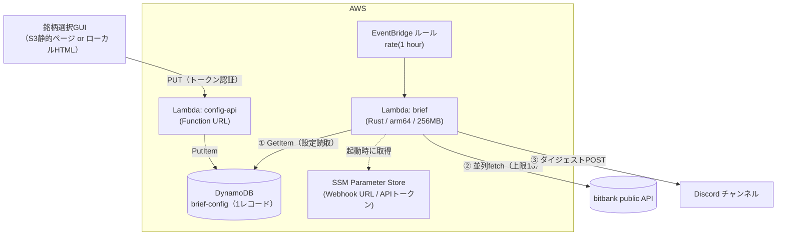

# aws-hourly-brief 設計書

periodical-brief (Rust) を AWS 上で1時間ごとに実行し、出力ダイジェストを
Discord Webhook へ配信する。brief 対象銘柄は DynamoDB 上の設定1レコードで
動的に変更できる。

- 位置づけ: 本リポジトリの実験（`rust-direct/`、`benchmark/`）の実運用化。
  記事で言う「コンパイル・モードの常時運用」。
- 姉妹プロジェクト [sudden-change-detector](https://github.com/aobathree/sudden-change-detector)
  と同じ運用系（EventBridge → Lambda → DynamoDB + Discord Webhook、SAM デプロイ）に揃える。
- リソース計測（`benchmark/results-resources.md`）で実証済みのとおり、
  REST API 直接版は全44銘柄（取扱い銘柄すべて）でも CPU 0.05秒・1プロセス・20MB。
  **Lambda の最小クラスの器で全銘柄を毎時回してもコストはほぼゼロ**になる。

## 1. 全体アーキテクチャ



毎時の流れ: EventBridge が brief Lambda を起動 → DynamoDB から対象銘柄設定を
1回 GetItem → bitbank public API を並列 fetch（同時数上限16、`rust-direct/` と同一）→
1銘柄3行のダイジェストを生成 → Discord Webhook へ送信。

銘柄変更の流れ: GUI で銘柄を選び直す → config-api Lambda（Function URL）へ
PUT → DynamoDB 更新 → **次回実行分から**新しい銘柄構成で届く（brief Lambda は
毎回設定を読むため、反映にデプロイ不要）。

## 2. フォルダー構成（実装時）

```
aws-hourly-brief/
├── DESIGN.md              # 本書
├── template.yaml          # SAM テンプレート（全リソース定義）
├── Makefile               # cargo lambda build → sam deploy
├── brief-core/            # rust-direct から抽出する共有ライブラリ crate
│   └── src/lib.rs         #   fetch / 指標計算 / ダイジェスト生成 / セマフォ
├── lambda-brief/          # 毎時実行の本体（bin crate）
│   └── src/main.rs        #   config読取 → brief-core → Discord送信
├── lambda-config-api/     # 設定 GET/PUT API（bin crate）
│   └── src/main.rs
└── gui/
    └── index.html         # 銘柄選択ページ（静的1枚。S3 に置くか手元で開く）
```

`brief-core` は `rust-direct/src/main.rs` の fetch・指標・整形ロジックを
そのまま lib 化する（ゴールデンテスト: 同一入力で CLI 版と出力一致を確認してから移行）。
`rust-direct/` と `docs/proposals/periodical-brief/rust/` は将来これを依存に
書き換えて一本化してもよい（当面は現状維持で可）。

## 3. コンポーネント設計

### 3.1 brief Lambda（毎時実行）

| 項目 | 値 | 根拠 |
|---|---|---|
| ランタイム | `provided.al2023` (Rust, cargo-lambda) | ネイティブ・コールドスタート最小 |
| アーキテクチャ | arm64 (Graviton) | x86 比 約20%安 |
| メモリ | 256MB | 実測ピーク20MB + TLSバッファ余裕 |
| タイムアウト | 60秒 | 通常1〜2秒。レート制限失速時（〜26秒実測）も収まる |
| トリガー | EventBridge `rate(1 hour)` | 毎時。cron 形式 `cron(0 * * * ? *)` にすれば毎正時（UTC）に固定可 |
| 環境変数 | `TABLE_NAME`, `WEBHOOK_PARAM`, `BITBANK_BRIEF_CONCURRENCY=16` | |
| IAM | 対象テーブルの GetItem、対象パラメーターの GetParameter のみ | 最小権限 |

処理フロー:

1. SSM から Webhook URL 取得（初回のみ。以降はプロセス内キャッシュ）
2. DynamoDB `GetItem(pk="config")`。**取得失敗・レコード無しは既定値
   （btc_jpy eth_jpy xrp_jpy）にフォールバックし、必ず配信は行う**
3. `mode` に応じて対象銘柄を確定（`top`/`all` は tickers API でランキング）
4. brief-core で並列 fetch → ダイジェスト生成（ペア単位のエラーは ERROR 行として
   そのまま本文に含める＝現行 CLI と同じ挙動。全滅時のみ後述のエラー通知）
5. Discord へ送信（3.3）

### 3.2 設定データモデル（DynamoDB）

テーブル `periodical-brief-config`（オンデマンド課金、PK のみ）:

```jsonc
{
  "pk": "config",              // 固定キー。設定は常に1レコード
  "mode": "pairs",             // "pairs" | "top" | "all"
  "pairs": ["btc_jpy", "eth_jpy", "xrp_jpy"],  // mode=pairs のとき使用
  "top_n": 10,                 // mode=top のとき使用
  "enabled": true,             // false なら配信スキップ（一時停止用）
  "updated_at": "2026-08-02T12:34:56+09:00",
  "note": "手動更新メモ（任意）"
}
```

- 読み取り: 毎時1回（720回/月）。書き込み: GUI 操作時のみ。
- スキーマ検証は config-api 側で実施（存在しないペア名は tickers 照合で拒否）。
- 将来の拡張（通知時間帯フィルター、複数チャンネル等）もこのレコードに
  属性追加で対応できる。

### 3.3 Discord 送信

制約: メッセージ本文は **2000文字上限**。44銘柄フル出力は約9KBで超過する。

- 本文は ` ```text 〜 ``` ` のコードブロックで送る（等幅で桁が揃う）
- **ペア境界で1900文字以下にチャンク分割**し、複数メッセージを順次 POST
  （間隔0.5秒、HTTP 429 は `retry_after` に従い1回リトライ）
- 銘柄数が多い場合（例: 20銘柄超）は代替モード: ヘッダー＋上位数銘柄を本文、
  全文を `.txt` 添付（Webhook は multipart のファイル添付に対応）。
  既定は「チャンク分割」、添付モードは設定 `delivery: "file"` で切替
- 全銘柄 fetch 失敗など配信物が空のときは、エラー内容を1行だけ通知
  （沈黙障害を防ぐ。連続失敗の検知は CloudWatch アラームに委ねる）

### 3.4 config-api Lambda + GUI

- **Function URL**（API Gateway 不使用 = 追加コストなし）で
  `GET /config` と `PUT /config` を提供
- 認証: `X-Auth-Token` ヘッダーの共有トークン（SSM SecureString に保存）。
  個人運用のため IAM/Cognito は過剰と判断。トークンは GUI 側で入力
- CORS: GUI の配置先オリジンのみ許可
- GUI は**静的 HTML 1枚**（フレームワーク不使用）:
  - 起動時に `GET /config` と bitbank tickers（public API・CORS 可）を取得し、
    取扱い全44銘柄を売買代金降順のチェックボックス一覧で表示
  - mode（pairs / top N / all）切替、保存ボタンで `PUT /config`
  - 配置は S3 静的ウェブサイトホスティング（数円/月）か、
    リポジトリ内の HTML を手元でブラウザーで開くだけでも成立する
    （Function URL に直接 PUT するため、ホスティングは必須ではない）

## 4. コスト見積り（月額・東京リージョン）

| リソース | 使用量 | 概算 |
|---|---|---|
| Lambda (brief) | 720回 × 約2秒 × 256MB arm64 ≈ 360 GB秒 | 無料枠内（枠外でも約 $0.01） |
| Lambda (config-api) | 操作時のみ（数回/月） | ほぼ $0 |
| EventBridge ルール | 720イベント | $0（AWSサービス起動は無料） |
| DynamoDB オンデマンド | 読取720 + 書込数回、ストレージ1KB | 約 $0.001 |
| SSM Parameter Store | 標準パラメーター2件 | $0 |
| CloudWatch Logs | 保持7日設定、数MB | 約 $0.01 |
| S3（GUI を置く場合） | 静的1ファイル | 約 $0.01 |
| **合計** | | **実質 $0 〜 $0.05/月** |

常時起動リソース（EC2/Fargate/NAT Gateway/ALB）を一切使わないことが
低コストの要点。Lambda は VPC 外に置く（bitbank/Discord へは公開インターネット
経由。VPC に入れると NAT が必要になり月額数千円級に跳ねる——**本設計最大の
コスト地雷なので明記**）。

## 5. 運用・監視

- **ログ**: ダイジェスト全文と実行時間を CloudWatch Logs へ（保持7日）
- **アラーム**: brief Lambda の `Errors >= 1`（5分）で SNS → メール等。
  Discord 側の障害と bitbank 側の障害を切り分けられるよう、
  「fetch失敗」「Discord送信失敗」はログ上で区別する
- **レート制限**: 同時数上限16は Lambda 内でも維持。毎時1回・720回/月の
  アクセスは公開APIの利用として十分保守的
- **時刻**: EventBridge は UTC。毎正時 JST に届けたい場合も `cron(0 * * * ? *)`
  （毎時0分）で同じ。特定時刻のみ配信したい場合は cron 式で絞る
  （例: JST 8時〜23時のみ = `cron(0 23-14 * * ? *)` ※UTC表記）

## 6. セキュリティ

- Discord Webhook URL・API トークンは **SSM SecureString**。
  テンプレート・リポジトリには置かない（sudden-change-detector と同運用）
- IAM は関数ごとに分離し最小権限（brief: GetItem+GetParameter /
  config-api: GetItem+PutItem+GetParameter）
- Function URL は AuthType=NONE + アプリ層トークン認証。
  誤操作の影響範囲は「配信銘柄が変わる」のみで資金・秘密情報には触れない
- bitbank の**秘密APIキーは一切使わない**（public API のみ）

## 7. 実装フェーズ

| フェーズ | 内容 | 完了条件 |
|---|---|---|
| P1 | brief-core 抽出 + lambda-brief（銘柄は環境変数固定）+ SAM + Discord配信 | 毎時、既定3銘柄のダイジェストが Discord に届く |
| P2 | DynamoDB 設定読取（フォールバック付き） | レコードを手で書き換えると次回から反映される |
| P3 | config-api + GUI | GUI で銘柄を選び直すと次回から反映される |
| P4（任意） | 添付モード、時間帯フィルター、アラーム整備 | — |

P2 完了時点で「動的変更」は AWS CLI からでも可能になる
（`aws dynamodb put-item ...`）。GUI は最後でよい。

## 8. 未決事項

1. **配信フォーマットの最終形** — 44銘柄を毎時受け取ると流量が多い。
   既定を top10 程度にするか、全銘柄は1日1回＋毎時は選択銘柄のみ、等の
   運用は使いながら決める（設定レコードで切替可能にしておく）
2. **Rust版CLIとの関係** — brief-core を正本とし、`rust-direct/` を
   その薄いCLIラッパーに書き換えるか（コード一本化）。P1 と同時に判断
3. **Discord メッセージの装飾** — embed（色付き枠）にすると視認性は
   上がるが文字数制約が変わる。まずはコードブロック平文で開始
4. **本家 periodical-brief が実現した場合** — Issue #21 が採用されたら
   brief-core を本家CLI呼び出しに差し替える選択肢が生まれる。
   その際も本設計の器（EventBridge/Lambda/DynamoDB/Webhook）はそのまま使える
